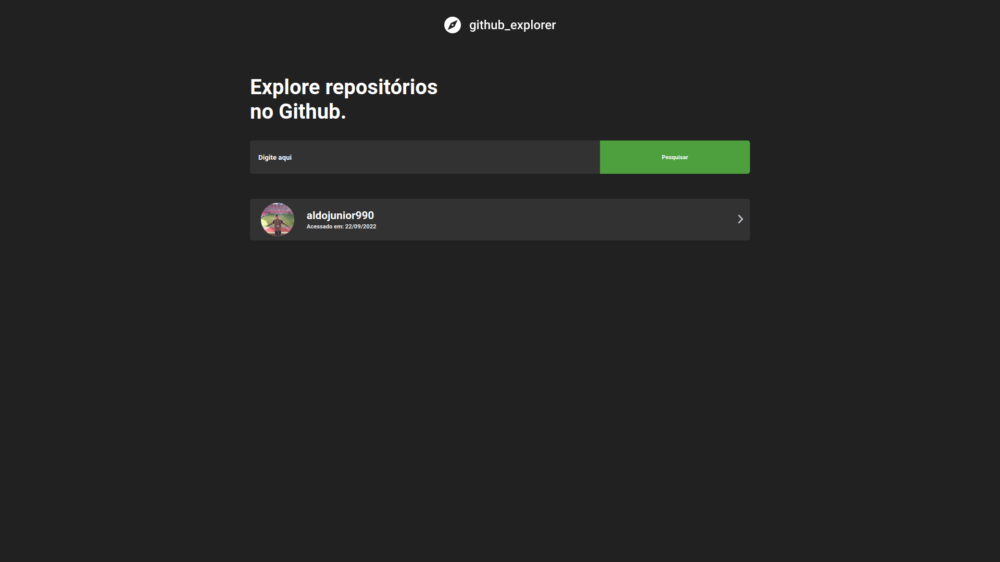

<h1 align="center">
  <strong>GITHUB-EXPLORER</strong>
</h1>
<br>

## Sobre o projeto - About the project

Esta aplição utiliza a api do GitHub para buscar e listar as informações e os repositorios de um devido usuario.

This application uses the GitHub api to search and list the information and repositories of a given user.

<h1 align="center" display="flex">
   
</h1>

<h1 align="center" display="flex">
   
</h1>

## :computer: Tecnologias - Technologies

Este projeto foi desenvolvido com as seguintes tecnologias:
<br>
This project was developed with the following technologies:

- [React](https://reactjs.org)
- [TypeScript](https://www.typescriptlang.org/)
- [Styled-components](https://styled-components.com/)
- [Axios](https://github.com/axios/axios)
  <br>

## Como executar - How to execute

Para iniciá-lo, siga as etapas abaixo:
<br>
To start it, follow the steps below:

```bash
# Instale as dependencias
# Install dependencies
$ yarn

# Inicie o projeto
# start the project
$ yarn dev
```

O aplicativo estará disponível em seu navegador no endereço http://localhost:3000.
<br>
The app will be available in your browser at the address http://localhost:3000.

O aplicativo também está disponível na web em produção https://github-explorer-liard.vercel.app
<br>
The app is also available on the web in production https://github-explorer-liard.vercel.app

<br>
